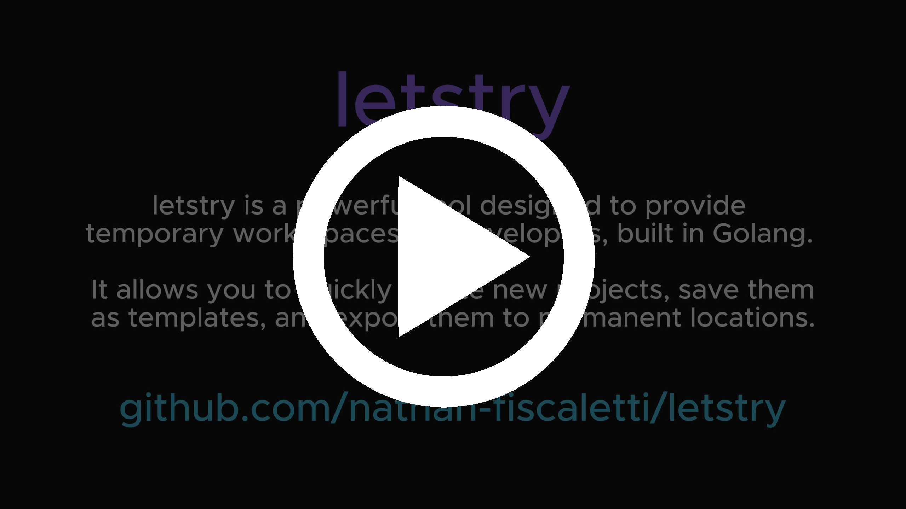

# letstry

[](https://github.com/sponsors/nathan-fiscaletti)

letstry is a powerful tool designed to provide temporary work-spaces for developers, built in Golang. It allows you to quickly create new projects, save them as templates, and export them to a more permanent location.

[](https://youtu.be/H0vJcw_KfTc)

## Installation

Letstry requires Go to be installed on your system. If you do not have Go installed, you can download it from the [official website](https://golang.org/dl/).

Once Go is installed, to install letstry, run the following command:

```sh
$ go install github.com/nathan-fiscaletti/letstry/cmd/letstry@latest
```

If you'd rather use the `lt` alias, you can install it using the following command:

```sh
$ go install github.com/nathan-fiscaletti/letstry/cmd/lt@latest
```

## Usage

### Creating a new Session

Creating a new session with letstry is simple and efficient. Use the `lt new` command to initialize a temporary project directory and open it in the default editor. This allows for quick prototyping. If you like the results, you can export the session to a more permanent location or save it as a template. 

```sh
$ lt new
```

If the VSCode window is closed, the temporary directory will be deleted. Therefore, you should either export your project using `lt export <path>` or save it as a template using `lt save <template-name>`.

Lets try sessions can be created from a directory path, a git repository URL, or a template name.

```sh
$ lt new <repository-url>
$ lt new <directory-path>
$ lt new <template-name>
```

### Exporting a Session

To export a session, use the `lt export` command from within the sessions directory. This will copy the session to the directory you specify.

```sh
$ lt export <path>
```

### Listing active sessions

To list all active sessions, use the `lt list` command.

```sh
$ lt list
```

### Managing Templates

**Creating a template**

Templates are a powerful feature of letstry. They allow you to save a project as a template and quickly create new projects based on that template.

To save an active session as a template, use the `lt save` command from within the sessions directory.

```sh
$ lt save [name]
```

If the session was initially created from an existing template, you can omit the name argument and the original template will be updated with the new session.

**Importing a Template**

You can easily import git repositories as templates using the `lt import` command.

```sh
$ lt import <template-name> <repository-url>
```

**Listing Templates**

To list all available templates, use the `lt templates` command.

```sh
$ lt templates
```

**Deleting a Template**

To delete a template, use the `lt delete-template` command.

```sh
$ lt delete-template <name>
```

## Configuration

letstry can be configured using a configuration file. The configuration file is located at `~/.letstry/config.json`.

The config file allows you to specify different editors if you do not use VSCode.

**Windows Config Example**

`~/.letstry/config.json`
```json
{
    "default_editor": "vscode",
    "editors": [
        {
            "name": "vscode",
            "run_type": "run",
            "path": "C:\\Users\\natef\\AppData\\Local\\Programs\\Microsoft VS Code\\Code.exe",
            "args": "-n",
            "process_capture_delay": 2000000000,
            "tracking_type": "file_access"
        }
    ]
}
```

## Contributing

We welcome contributions to improve letstry. If you have suggestions or bug reports, please open an issue or submit a pull request.

## Development

To install letstry for development, run the following command from the root of the project:

```sh
$ go install ./...
```

**Attaching a Debugger in VSCode**

To attach a debugger in VSCode you will first need to configure the command line arguments with which you wish the application to be launched. You can do this in the [./.vscode/launch.json](./.vscode/launch.json) file.

Then open the Run and Debug tab in VSCode (Ctrl+Shift+D on Windows) and select the `Launch Go Program` configuration.

## License

This project is licensed under the MIT License.